# Creating Your First Project

```toc

```

## 1. Project Setup

This guide will lead you through creating a small todo application.


To set up the project, open a terminal and create a new project directory:

```bash
mkdir TodoApp
```

Switch to the `TodoApp` directory before doing the next steps:

```bash
cd TodoApp
```

### Running

Start the development server by running the following docker command in the `TodoApp` directory:

```bash
docker run -p 8000:8000 \
    -p 8001:8001 \
    --pull=always \
    -v $PWD:/home/app/Application \
    ghcr.io/digitallyinduced/thin-backend:latest
```

[If you don't have docker installed, you can get it on the Docker website.](https://www.docker.com/get-started)

On first start, it will take a few seconds to pull the docker image.

Once the server has started, you can find the local dev tools at `http://localhost:8001`. Additionally at `http://localhost:8000` Thin Backend provides it's GraphQL server.

The docker image contains an integrated postgres server. Therefore there's no need to link a postgres container for now. You'll later learn how to start a Thin Backend container with an external postgres instance.

### Directory Structure

The new `TodoApp` directory now contains a couple of auto-generated files and directories that make up your app.

Here is a short overview of the whole structure:

| File or Directory             | Purpose                                                                             |
| ----------------------------- | ----------------------------------------------------------------------------------- |
| Schema.sql                    | Database tables are defined here                                                    |
| Fixtures.sql                  | Fills the database with test data for local development                             |
| Migrations/                   | Database migrations are stored here                                                 |
| jwt.pub                       | Public key generated for the JWT-based auth in your project                         |
| jwt.secret                    | Secret key generated for the JWT-based auth in your project                         |

It's recommended to track all these files in git.

## 2. Hello World

Open [`http://localhost:8001`](http://localhost:8001) and you will see this:

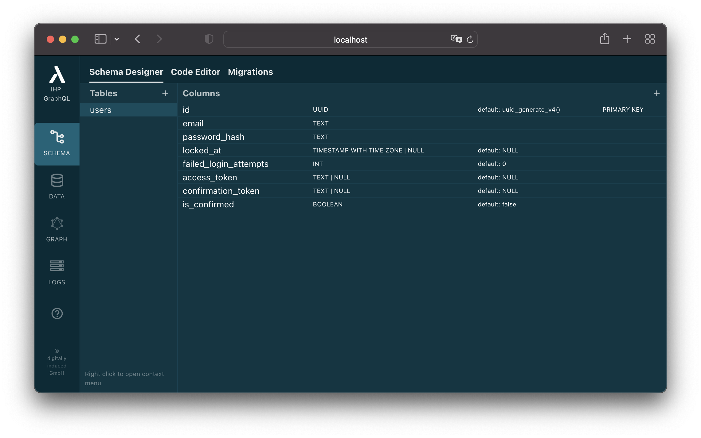

This is the Schema Designer. The Schema Designer will be used in the following sections of this tutorial. The schema designer helps to quickly build the DDL statements for your database schema without remembering all the PostgreSQL syntax and data types. But keep in mind: The schema designer is just a GUI tool to edit the `Schema.sql` file. This file consists of DDL statements to build your database schema. The schema designer parses the `Schema.sql`, applies changes to the syntax tree, and then writes it back into the `Schema.sql`. If you love your VIM, you can always skip the GUI and go straight to the code in `Schema.sql`. If you need to do something advanced which is not supported by the GUI, just manually do it with your code editor of choice. Thin Backend is built by terminal hackers, so don’t worry, all operations can always be done from the terminal :-)

Theres already a `users` table. This table is by default added to any new project, so that the integrated login server works. It's not required and in the Auth documentation you can learn how to use your own custom login system.

## 3. Creating a Table

For our todo app project, let's first build a way to manage tasks.

For working with tasks, we first need to create a `tasks` table inside our database. A single task has a title, a timestamp when it was created, a user id, and of course an id field for the task itself.

Thin Backend is using UUIDs instead of the typical numerical ids.

This is what your `tasks` table might look like:

| `id` :: `UUID` | `title` :: `Text` | `created_at` :: `Timestamp` | `user_id` :: `UUID` |
|--- |--- |--- |--- |
|8d040c2d-0199-4695-ac13-c301970cff1d|Learn Haskell|2022-01-03 18:14:51|1d89c722-7269-46d3-b71b-ec6742867363|
|ad938116-a2ac-44ce-9201-cc66b8a4bb51|Learn IHP|2022-01-03 18:20:15|1d89c722-7269-46d3-b71b-ec6742867363|


To work with tasks in our application, we now have to define this data schema.

Open the Schema Designer by clicking the `SCHEMA` button in the dev tools:

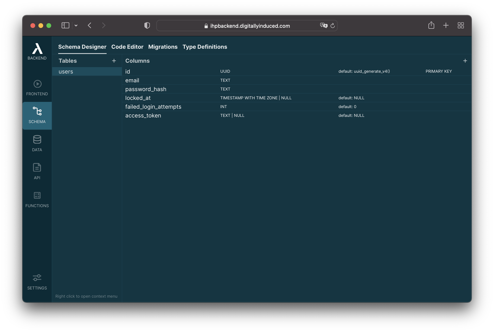

1. Right click into the `Tables` pane and click `Add Table`
    
    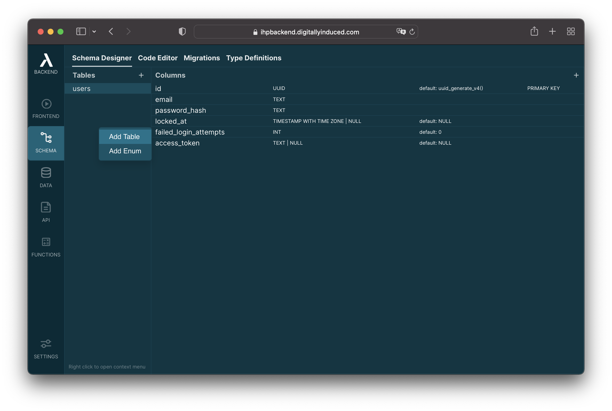

2. Enter the table name `tasks` and click on `Create Table`:
    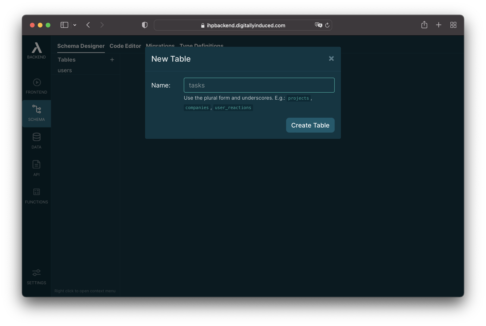


In the right pane, you can see the columns of the newly created table. The `id` column has been automatically created for us.

1. Right-click into the `Columns` pane and select `Add Column`:
    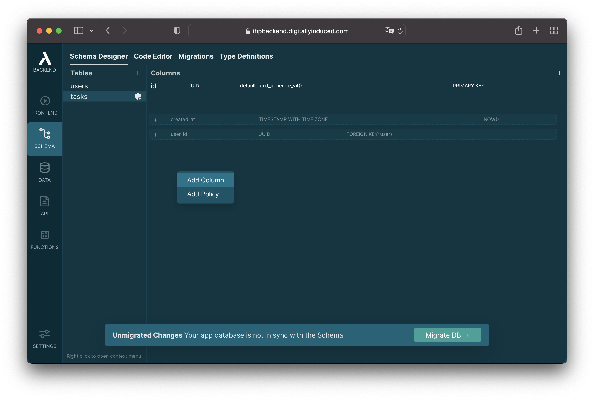
2. Use this modal to create the `title`:
    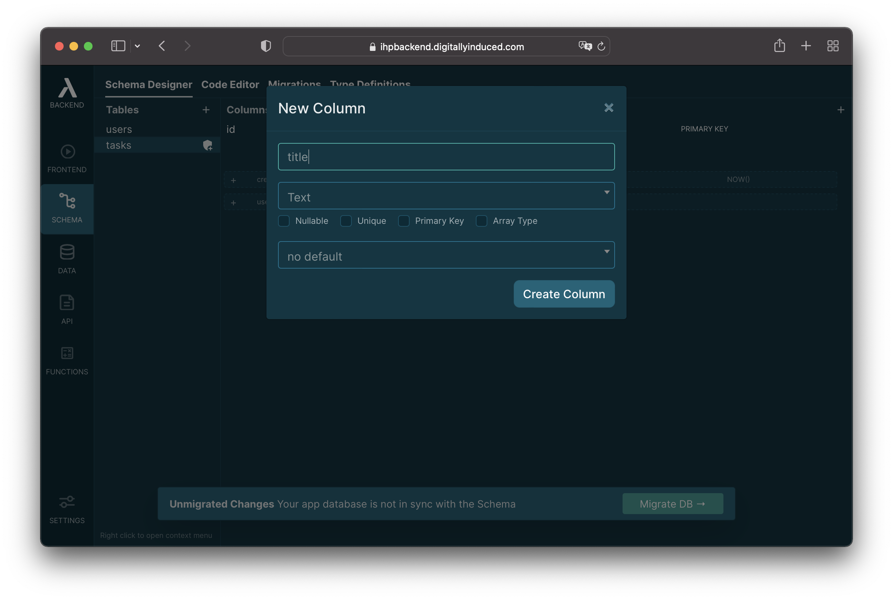

3. Now let's add the `created_at` timestamp column. You can see that Thin automatically suggest this `created_at` column below the table definition:
    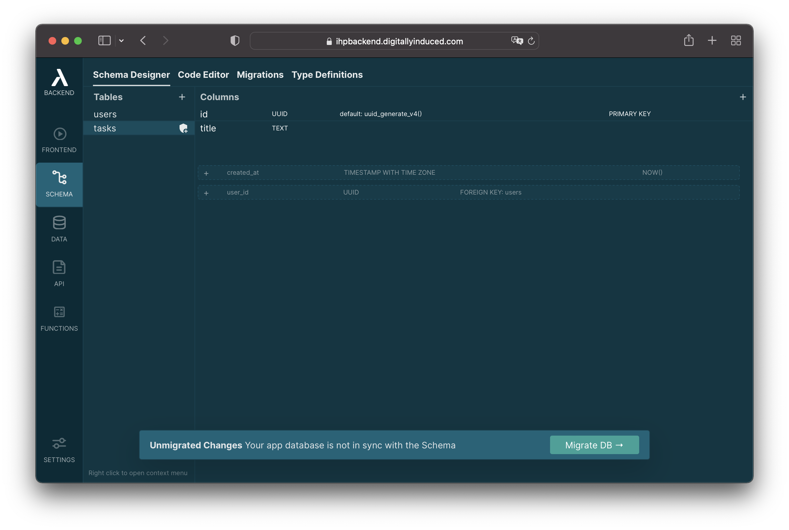

    Click on the suggested `created_at` column to add it to the `tasks` table:

    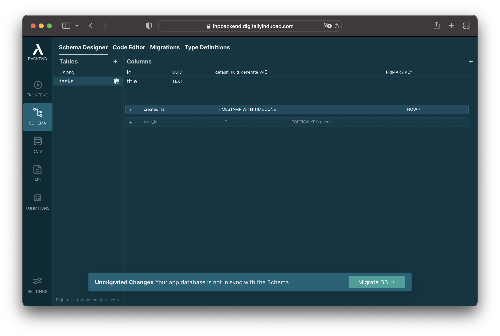

    Now it will look like this:

    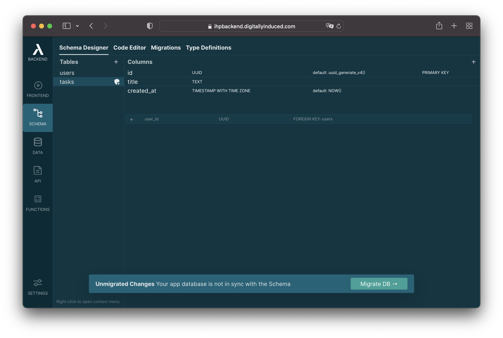

4. The only column left now is the `user_id`.
    
    The schema designer is also suggesting to add this for us. Click it to add the `user_id` column:

    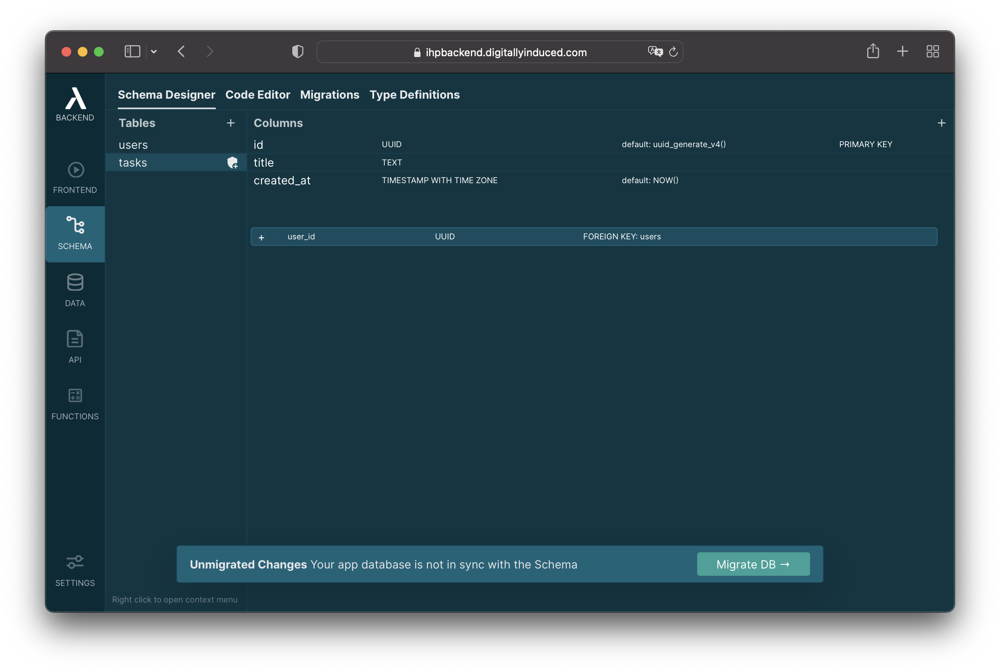

    After the `user_id` column has been added, you'll also see a new index and a policy appear.
    Thin often uses convention over configuration to provide good defaults for your app:

    - The index on the `user_id` column is added because it's common to run database queries like "Give me all tasks for a specific user".
    - The policy is defined to only grant a user access to their own tasks.
      The policy says that the user cannot access tasks where the `user_id` field is different than the current user id.
      Additionally a task can only be added when the `user_id` field is set to the current user id.

5. After that, your schema should look like this:
    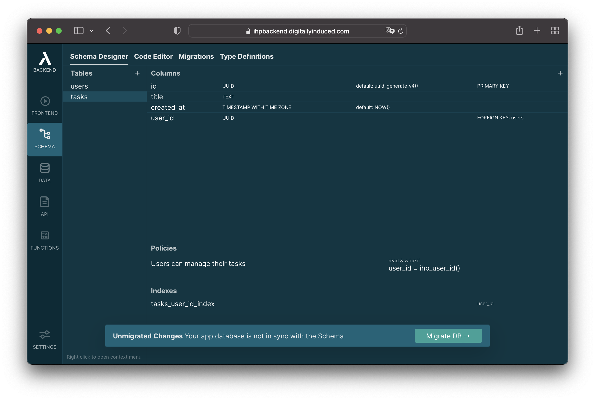

## 4. Running Migrations

Next, we need to make sure that our database schema with our `tasks` table is imported into the Thin PostgreSQL database.
For that we'll create and run a database migration.

1. Click the `Migrate DB` button at the bottom of the page
        
    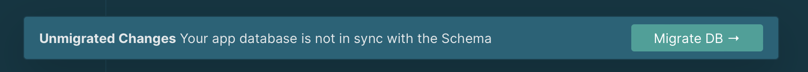

2. Thin already prepared a few SQL statements to migrate our DB. Typically we don't need to make any changes here.

    Once your app is running in production, you might want to review and modify the auto generated SQL statements to make sure that everything goes as planned.

    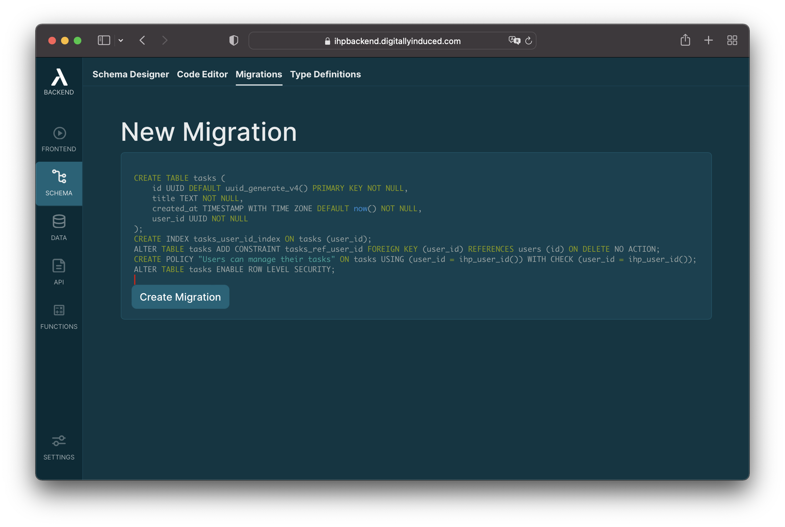

    Click `Create Migration` after you've quickly reviewed the SQL.

3. The migration has been created:
    
    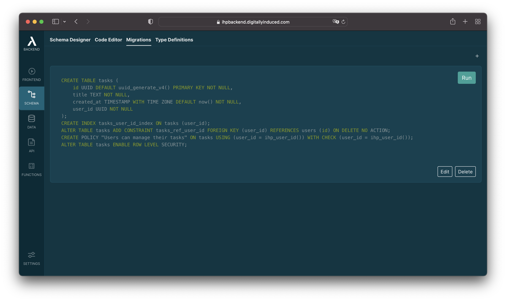

    Click `Run` to apply the migration to the app database:
    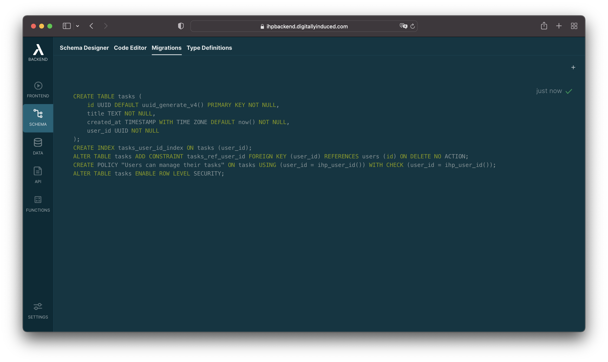

The `tasks` table has been created now. Let’s quickly connect to our database and see that everything is correct:

1. Click on the `DATA` button in the left navigation.
2. In the `DATA` editor, click on the `tasks` table.
3. You should see an empty table:
    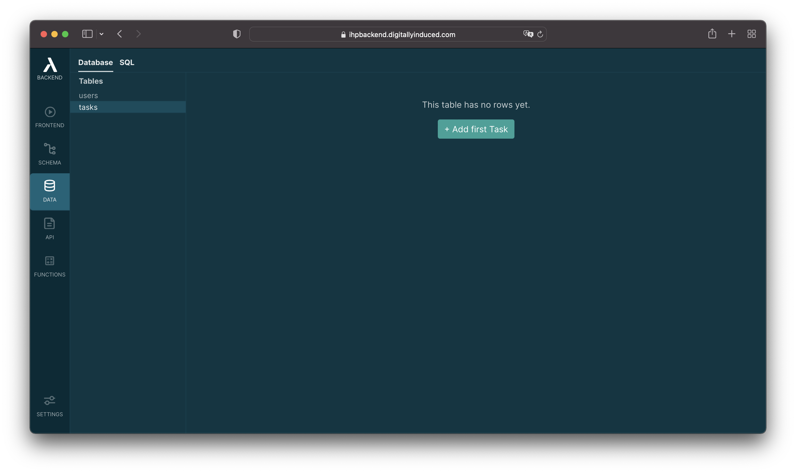
    
    If there was some issue with the migration, the `tasks` would not be in the table list at the left.

Now our database is ready to be consumed by our React app.


## 5. The Frontend

*This guide uses React and a custom GraphQL client for connecting to the GraphQL API. You can of course build the frontend however you like, and e.g. use a different view library and a different GraphQL client (like e.g. Apollo).*

### NPM

First we need to set up a new npm project. Run `npm init` and follow the instructions on the screen:

```bash
npm init
```

**Don't forget this:**

Open `package.json` and set `"type": "module",`, like this:

```javascript
{
  "name": "todo-app",
  "type": "module", // <----
  "dependencies": {
    // ...
  }
}
```

This enables support for ES6 style imports.


Next we need react and a bundler:

```bash
npm install esbuild react react-dom
```

Additionally we need to install `ihp-backend` package for dealing with auth, and the `ihp-datasync` package for having a GraphQL Client:

```bash
npm install ihp-backend "https://gitpkg.now.sh/digitallyinduced/ihp/lib/IHP/DataSync?3d301459e675038cc7786dcbd42bf5dab4e90157"
```

### ESBuild


Create a `server.js` file and paste this into it:

```javascript
import esbuild from 'esbuild'
import { createServer, request } from 'http'
import { spawn } from 'child_process'

const clients = []

esbuild
  .build({
    entryPoints: ['./app.jsx'],
    bundle: true,
    outfile: 'public/app.js',
    banner: { js: ' (() => new EventSource("/esbuild").onmessage = () => location.reload())();' },
    define: {
      'process.env.NODE_ENV': JSON.stringify("development"),
    },
    watch: {
      onRebuild(error, result) {
        clients.forEach((res) => res.write('data: update\n\n'))
        clients.length = 0
        console.log(error ? error : '...')
      },
    },
  })
  .catch(() => process.exit(1))

esbuild.serve({ servedir: './public', port: 3001 }, {}).then(() => {
  createServer((req, res) => {
    const { url, method, headers } = req
    if (req.url === '/esbuild')
      return clients.push(
        res.writeHead(200, {
          'Content-Type': 'text/event-stream',
          'Cache-Control': 'no-cache',
          Connection: 'keep-alive',
        })
      )
    const path = ~url.split('/').pop().indexOf('.') ? url : `/index.html` //for PWA with router
    req.pipe(
      request({ hostname: '0.0.0.0', port: 3001, path, method, headers }, (prxRes) => {
        res.writeHead(prxRes.statusCode, prxRes.headers)
        prxRes.pipe(res, { end: true })
      }),
      { end: true }
    )
  }).listen(3000)

  console.log('Development server running on http://localhost:3000')

  setTimeout(() => {
    const op = { darwin: ['open'], linux: ['xdg-open'], win32: ['cmd', '/c', 'start'] }
    const ptf = process.platform
    if (clients.length === 0) spawn(op[ptf][0], [...[op[ptf].slice(1)], `http://localhost:3000`])
  }, 1000) //open the default browser only if it is not opened yet
})
```

This file contains a small server that drives `esbuild` to bundle our JS app.

We also need to add a `index.html` file that will load our app.

1. Create a `public` directory
2. Put this into `public/index.html`:

    ```html
    <!DOCTYPE HTML>
    <html lang="en">
        <head>
            <meta charset="utf-8">
            <meta name="viewport" content="width=device-width, initial-scale=1, shrink-to-fit=no">

            <!-- Customize these Open Graph tags for nice meta data when sharing on social networks -->
            <meta property="og:title" content="App">
            <meta property="og:type" content="website">
            <meta property="og:url" content="TODO">
            <meta property="og:description" content="TODO">

            <!-- By default we include bootstrap here, but you can use whatever CSS framework you like -->
            <link rel="stylesheet" href="https://cdn.jsdelivr.net/npm/bootstrap@4.6.1/dist/css/bootstrap.min.css" integrity="sha384-zCbKRCUGaJDkqS1kPbPd7TveP5iyJE0EjAuZQTgFLD2ylzuqKfdKlfG/eSrtxUkn" crossorigin="anonymous">

            <!-- App specific CSS -->
            <link rel="stylesheet" href="/app.css">

            <title>App</title>
        </head>
        <body>
            <div id="app"></div>


            <!-- Don't need bootstrap JS helpers? Remove the following: -->

            <script src="https://cdn.jsdelivr.net/npm/jquery@3.5.1/dist/jquery.slim.min.js" integrity="sha384-DfXdz2htPH0lsSSs5nCTpuj/zy4C+OGpamoFVy38MVBnE+IbbVYUew+OrCXaRkfj" crossorigin="anonymous"></script>
            <script src="https://cdn.jsdelivr.net/npm/bootstrap@4.6.1/dist/js/bootstrap.bundle.min.js" integrity="sha384-fQybjgWLrvvRgtW6bFlB7jaZrFsaBXjsOMm/tB9LTS58ONXgqbR9W8oWht/amnpF" crossorigin="anonymous"></script>

            <!-- Include the app bundle -->
            <script src="/app.js"></script>
        </body>
    </html>
    ```

### The App

Next we need to implement our app. Create a file `app.jsx` and paste this into it:

```javascript
import React, { useState, useEffect } from 'react';
import * as ReactDOM from 'react-dom'

import { initIHPBackend } from 'ihp-datasync';
import { IHPBackend, useCurrentUserId } from 'ihp-backend/react';
import { useGraphQLQuery } from 'ihp-datasync/react';
import * as GraphQL from 'ihp-datasync/graphql';
import * as Backend from 'ihp-backend';

function App() {
    // With `useQuery()` you can access your database:
    // 
    //     const todos = useQuery(query('todos').orderBy('createdAt'));
    //

    return <IHPBackend requireLogin={false}>
        <div className="container">
            <AppNavbar/>
            <Tasks />
        </div>
    </IHPBackend>
}

function Tasks() {
    const result = useGraphQLQuery('{ tasks { id title userId } }');
    if (result === null) {
        return <div>Loading...</div>
    }

    return <div>
        <h1>Tasks</h1>
        <div className="mb-4">
            {result.tasks.map(task => <Task key={task.id} task={task} />)}
        </div>
        <AddTaskButton/>
    </div>
}

function Task({ task }) {
    return <div>
        {task.title}
    </div>
}

function AddTaskButton() {
    function addTask() {
        const task = {
            title: 'Hello World',
        };
        GraphQL.query('mutation { createTask(task: $task) }', { task })
    return <button className="btn btn-primary" onClick={addTask}>
        Add Task
    </button>
}

function AppNavbar() {
    // Use the `useCurrentUserId()` react hook to access the current logged in user
    const userId = useCurrentUserId();

    // This navbar requires bootstrap js helpers for the dropdown
    // If the dropdown is not working, you like removed the bootstrap JS from your index.html

    return <nav className="navbar navbar-expand-lg navbar-light bg-light mb-5">
        <div className="collapse navbar-collapse" id="navbarSupportedContent">
            <ul className="navbar-nav ml-auto">
                <li className="nav-item dropdown">
                    <a className="nav-link dropdown-toggle" href="#" id="navbarDropdown" role="button" data-toggle="dropdown" aria-haspopup="true" aria-expanded="false">
                        {userId}
                    </a>
                    <div className="dropdown-menu" aria-labelledby="navbarDropdown">
                        <a className="dropdown-item" href="#" onClick={() => Backend.logout()}>Logout</a>
                    </div>
                </li>
            </ul>
        </div>
    </nav>
}

// This needs to be run before any calls to `query`, `createRecord`, etc.
initIHPBackend({ host: 'http://localhost:8000' });
Backend.initIHPBackend({ host: 'http://localhost:8000' });

// Start the React app
ReactDOM.render(<App/>, document.getElementById('app'));
```

### Starting

Now our frontend is ready. Run `node server.js` to start the bundler.

```bash
node server.js
```


## 6. Summary

You've now implemented the basics of todo management. Congrats!

Along the way you've learned the basic operations of Thin Backend:

- Fetching data with `useQuery` and GraphQL
- Creating data using the `createTask(task: $task)` mutation
- Updating data using the `updateTask(id: $taskId, patch: $patch)` mutation
- Deleting data using the `deleteTask(id: $taskId)` mutation

You now understand enough of Thin Backend to be dangerous. The best way to continue your journey is to start building things. Take a look at the other Guides to learn more about all the functionality provided by Thin Backend.
