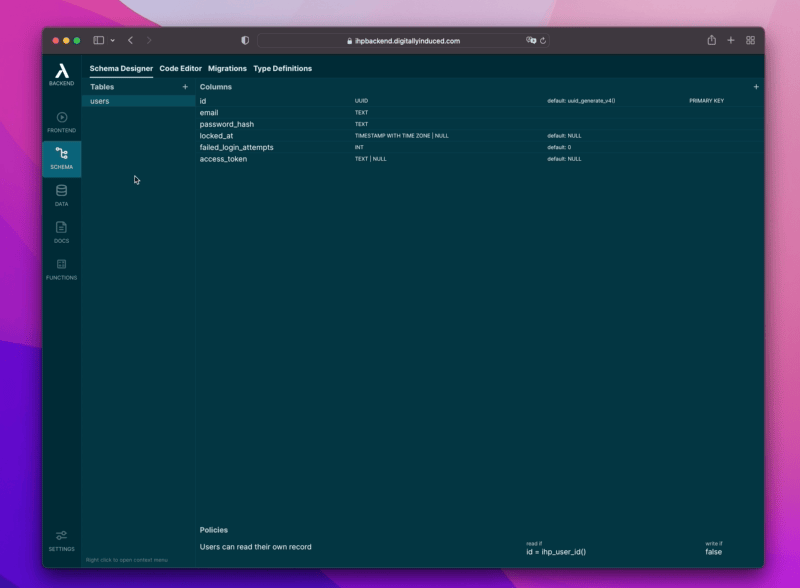
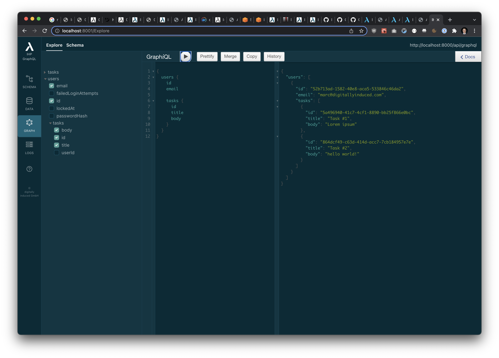

<p align="center">
  <a href="https://ihp.digitallyinduced.com/" target="_blank">
    
  </a>
</p>

<p align="center">
  

  <a href="https://twitter.com/digitallyinduce" target="_blank">
    
  </a>
</p>

<p align="center">
  <a href="https://thinbackend.app/" target="_blank">
    Website
  </a>
  |
  <a href="https://thinbackend.app/docs/index.html" target="_blank">
    Documentation
  </a>
</p>

# About Thin Backend (IHP GraphQL)

Thin Backend is a blazing fast GraphQL Server that provides an instant GraphQL API for any postgres database.

## What makes it different?

**Blazing Fast, Low Latency:**
Delight your end-users with superior speed and lowest latency. Thin Backend is built with Haskell, the most powerful functional programming language, to make your API calls return with lowest latency.

**Live Queries:**
Provide a delightful experience to your end users: With Thin Backend Live Queries your app state can be synchronized in real-time across all users.

**Zero-setup Login:**

Every Thin Backend project comes with zero-setup login, user management and permissions system included.

Already have an existing login system? No problem, you can disable the built-in login and provide Thin Backend with a JWT.

**Secure Authorization:**

Thin Backend uses Postgres Policies to make sure that users can only see what they're allowed to see.

Based on naming conventions Thin Backend will automatically generate the initial policies for you. You then only need to adjust the default policies based on your needs.

**Powerful Schema Designer:**



Thin Backend has a built-in GUI-based schema designer. The schema designer helps to quickly build the DDL statements for your database schema without remembering all the PostgreSQL syntax and data types.

But keep in mind: The schema designer is just a GUI tool to edit the underlying SQL statements. The schema designer parses the SQL statements, applies changes to the syntax tree, and then writes it back.

Rather work with your keyboard? You can always skip the GUI and go straight to the code editor. If you need to do something advanced which is not supported by the GUI, just manually do it with your code editor of choice.

**Create Tables in a Git-like Workflow:**

Whenever you add or change a table in the Schema Designer, the changes will only be applied to the in-memory schema. The actual postgres database will only be touched when you run migrations.

You can think of this like in a git workflow: In git changes are only applied to the repository history when you do a git commit. In Thin Backend this git commit is running a database migration.

## Documentation

[You can find extensive documentation on the Thin Backend website.](https://thinbackend.app/docs/index.html)


## Getting Started

1. Start Container with Docker:
    ```bash
    docker run -p 8000:8000 -p 8001:8001 --pull=always -v $PWD:/home/app/Application ghcr.io/digitallyinduced/thin-backend:latest
    ```

    **Explanation of ports:**
    - Port 8000: GraphQL server
    - Port 8001: Dev Tools
2. Open http://localhost:8001/
    
    
    
    In your browser the familiar IHP dev tools provide a GraphQL Server over IHP DataSync (WebSockets for low latency) or alternatively like other GraphQL servers via HTTP at http://localhost:8000/api/graphql (e.g. if you make a request from Postman it will just work).

    It's still missing a lot, but it's enough to be useful already

### Connect from JS

Currently the simplest way to connect to the GraphQL server is via IHP DataSync. This will use a WebSocket as the underlying communication channel, this leads to superior latency compared to normal HTTP requests.

Install IHP DataSync into your project:

```bash
npm install "https://gitpkg.now.sh/digitallyinduced/ihp/lib/IHP/DataSync?3b66d8db44a69a2d58c7b47f18996ce1a74f38bc"
```

Then you can run a query like this:

```javascript

import { useGraphQLQuery } from 'ihp-datasync/react';

function HelloWorld() {
    const result = useGraphQLQuery("{ users { id email tasks { id title } } }");
    if (result === null) {
        return <div>Loading</div>
    }

    return <div>
        {result.users.map(user => <User user={user} />)}
    </div>
}
```

Use the `query` function to run mutations:

```javascript
import * as GraphQL from 'ihp-datasync/graphql';

function AddTask() {
    async function addTask(event) {
        event.preventDefault();

        const task = {
            title: 'Hello World',
            body: 'hello',
            userId: '40f1dbb4-403c-46fd-8062-fcf5362f2154'
        };

        const newTask = await GraphQL.query(`
            mutation {
                createTask(task: $task) { id }
            }
        `, { task });
    }

    return <button onClick={addTask}>Add Task</button>
}
```

## Schema

Given an SQL schema like this:

```sql
CREATE TABLE users (
    id UUID DEFAULT uuid_generate_v4() PRIMARY KEY NOT NULL,
    email TEXT NOT NULL,
    password_hash TEXT NOT NULL,
    locked_at TIMESTAMP WITH TIME ZONE DEFAULT NULL,
    failed_login_attempts INT DEFAULT 0 NOT NULL
);
CREATE TABLE tasks (
    id UUID DEFAULT uuid_generate_v4() PRIMARY KEY NOT NULL,
    title TEXT NOT NULL,
    body TEXT NOT NULL,
    user_id UUID NOT NULL
);
CREATE POLICY "Allow access" ON tasks USING (true) WITH CHECK (true);
ALTER TABLE tasks ENABLE ROW LEVEL SECURITY;
CREATE INDEX tasks_user_id_index ON tasks (user_id);
ALTER TABLE tasks ADD CONSTRAINT tasks_ref_user_id FOREIGN KEY (user_id) REFERENCES users (id) ON DELETE NO ACTION;
```

Thin Backend will automatically offer these GraphQL queries and mutations:

```graphql
schema {
    query: Query
    mutation: Mutation
}

type Query {
    "Returns all records from the `users` table"
    users: [User!]!

    "Returns all records from the `tasks` table"
    tasks: [Task!]!
}

type Mutation {
    createUser(user: NewUser!): User!
    updateUser(id: ID!, patch: UserPatch!): User!
    deleteUser(id: ID!): User!

    createTask(task: NewTask!): Task!
    updateTask(id: ID!, patch: TaskPatch!): Task!
    deleteTask(id: ID!): Task!
}

scalar UUID
scalar Timestamp

type User {
    id: ID!
    email: String!
    passwordHash: String!
    lockedAt: Timestamp
    failedLoginAttempts: Int!
    tasks: [Task!]!
}
type Task {
    id: ID!
    title: String!
    body: String!
    userId: UUID!
}

input NewUser {
    id: ID!
    email: String!
    passwordHash: String!
    lockedAt: Timestamp
    failedLoginAttempts: Int!
}
input NewTask {
    id: ID!
    title: String!
    body: String!
    userId: UUID!
}

input UserPatch {
    id: ID!
    email: String!
    passwordHash: String!
    lockedAt: Timestamp
    failedLoginAttempts: Int!
}
input TaskPatch {
    id: ID!
    title: String!
    body: String!
    userId: UUID!
}
```

## Example Apps

You can find some example apps inside the `Examples` directory of this repository:

- [Todo App](https://github.com/digitallyinduced/thin-backend/tree/master/Examples/TodoApp)

## Community

Questions, or need help? [Join our Slack Community](https://ihp.digitallyinduced.com/Slack)

[Also check out the Forum!](https://ihp.digitallyinduced.com/community/)

## Contributing

We are happy to merge your pull requests!😄

See [CONTRIBUTING.md](CONTRIBUTING.md) for more info.