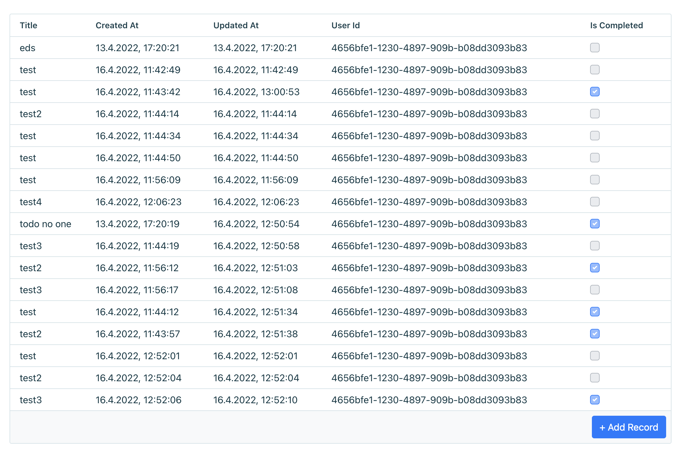

# Crud Component

The CRUD component is a table based view for quickly displaying, editing, creating and deleting database records

## Install

```
npm install thin-backend-components
```

## Usage

```javascript
import { Crud } from 'thin-backend-components';

function App() {
    return <IHPBackend requireLogin>
        <div className="container">
            
            <!-- Mount the Crud component and pass a query -->
            <Crud query={query('tasks')} />
        </div>
    </IHPBackend>
}

```

The rendered table will look like this:

